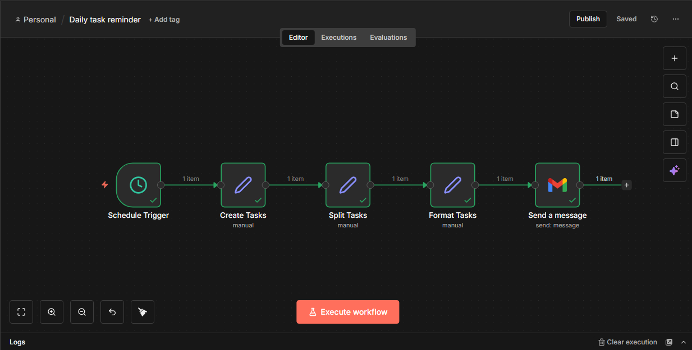

# Daily High Priority Task Email Automation (n8n)

##  Overview
This project is a practical **n8n automation workflow** that sends a **daily email containing only high-priority tasks**.  
The automation runs automatically on a schedule, processes structured task data, filters tasks based on priority, formats them into a readable message, and sends the result via email.

The goal of this project is to demonstrate **core automation fundamentals** such as scheduling, data transformation, conditional logic, expressions, and real-world output delivery.

---

##  What This Automation Does
- Runs automatically once per day using a **Schedule Trigger**
- Loads a predefined list of tasks
- Filters tasks marked as **high priority**
- Formats tasks into a clean, readable email body
- Sends the email using **Gmail**
- Requires **no paid APIs** or external services

---

##  Key Concepts Demonstrated
- Automation scheduling
- Working with arrays and objects
- JavaScript expressions inside n8n
- Data filtering using `.filter()`
- Data formatting using `.map()` and `.join()`
- Clean workflow structuring
- Email automation for real-world use cases

---

##  Workflow Structure

1. **Schedule Trigger**  
   Starts the workflow automatically at a defined time each day.

2. **Create Tasks (Set Node)**  
   Stores a structured list of tasks with priority levels.  
   This simulates real-world task data typically received from databases or APIs.

3. **Filter High Priority Tasks (Set Node)**  
   Uses JavaScript expressions to extract only tasks where priority is set to `"high"`.

4. **Format Tasks (Set Node)**  
   Converts filtered tasks into a human-readable bullet list suitable for email delivery.

5. **Send Email (Gmail Node)**  
   Sends the formatted task list to the specified email address.

---

## 📸 Workflow Screenshot

---

##  Files in This Repository

| File | Description |
|----|----|
| `workflow.json` | Exported n8n workflow |
| `workflow-screenshot.png` | Visual overview of the workflow |
| `README.md` | Project documentation |

---

##  How to Use This Workflow

1. Import `workflow.json` into your n8n instance
2. Configure Gmail credentials
3. Adjust task list or schedule time if needed
4. Activate the workflow
5. Receive daily high-priority task reminders automatically

---

##  Why This Project Matters
This automation represents a **real productivity use case** and mirrors the logic used in client projects such as:
- Daily work summaries
- Task prioritization systems
- Reminder and notification workflows
- Personal productivity automations

It demonstrates the ability to **design logic-based automations**, not just simple triggers.

---

##  Tags
`n8n` · `automation` · `workflow` · `email-automation` · `productivity`

---

